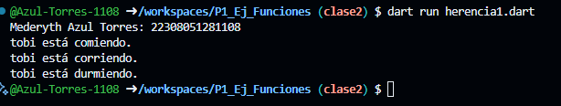

Crear una clase animal con los atributos (id_animal, nombre, raza) y una funcion comer().
Crear otra clase perro con herencia animal con las funciones correr() y otra dormir() en Dart

Salida de Datos: 
-------------------------------------------------------------------------------
