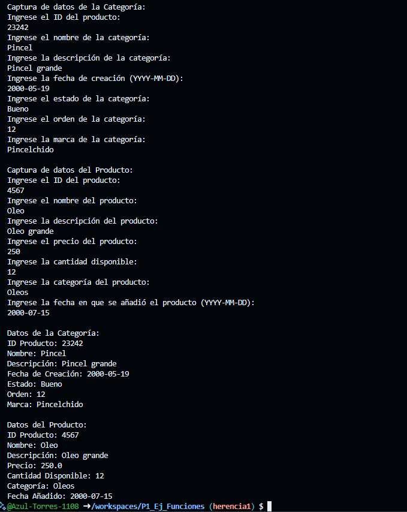

Crear la clase Categoria con los atributos (ID_Producto, Nombre, Descripcion, Fecha_creacion, Estado. Orden, Marca) con una función capturadatos(), con interacción con la interfaz de usuario. Productos(ID_producto, nombre, descripcion, precio, cant_Disponible, Categoria, Fecha_añadido); Crear la clase DatosCategoria con herencia Categoria y una funcion mostrarDatos(). En Dart

Salida de Datos:
----------------------------------------------------------------------------
