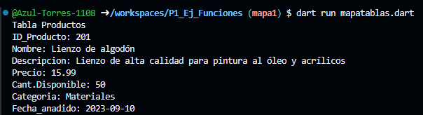
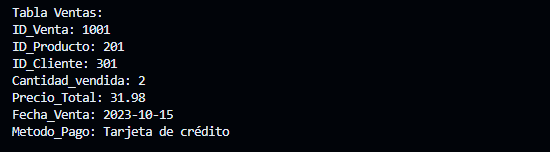
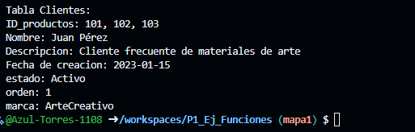

crear map <String, dinamic> Productos con los siguientes keys, ID_Producto, Nombre, Descripcion. Precio, Cant.Disponible, Categoria, Fecha_anadido, y mostrar los datos con un foreach, lenguaje Dart

crear map llamada Ventas con los siguientes keys, ID_Venta, ID_Producto, ID_Cliente, Cantidad_vendida, Precio_Total, Fecha_Venta, Metodo_Pago

crear map llamada clientes con los siguientes keys, ID_productos, Nombre, Descripcion, Fecha de creacion, estado, orden y marca
